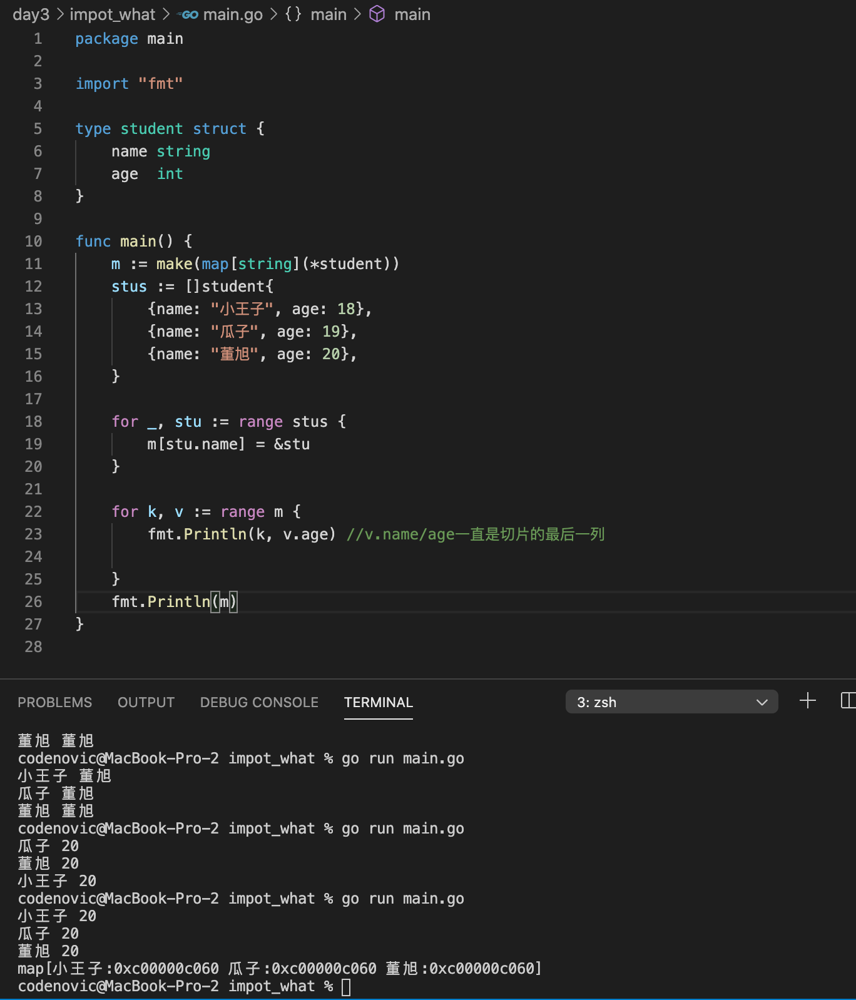
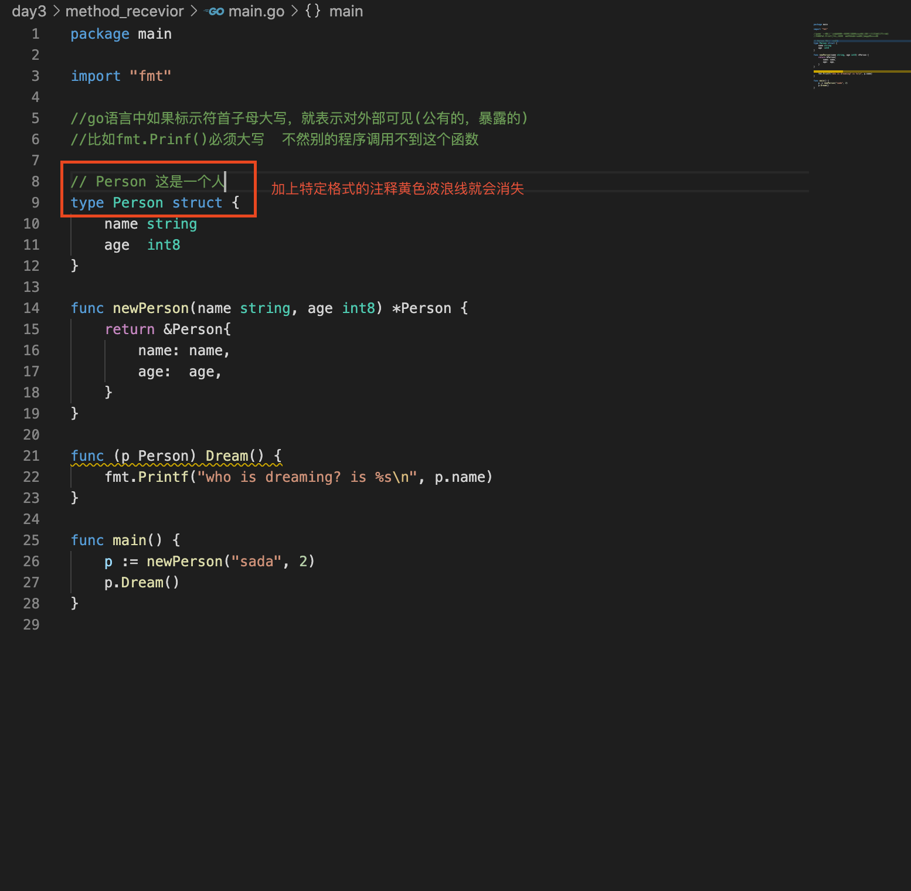

# 类型与变量

# 常量与运算符

# 控制语句

# 数组

数组是一个长度固定的数据类型，大小不可以变化

## 一维数组声明初始化

```go
var 数组变量名 [元素数量]type
```

* 数组的长度是数组类型的一部分

```go
var a [1]int;
var b [2]int;
a = b;//不可以，因为类型不同
```

* go中声明变量时，总会使用对 对用类型的零值对变量进行初始化

***声明初始化数组***

使用数组字面量声明数组：

```go
array := [5]int{1,2,3,4,5}
//...自动计算数组的长度
array := [...]int{1,2,3,4,5,5}
//索引值初始化数组
array := [5]int{2:10,3:12}//{下标:值}
```

***指针数组***

访问指针数组的元素

```go
//包含5个元素的指向整数的数组
var array [5]*int{0:new(int),3:new(int)}
*array[0] = 10
*array[1] = 20
```

复制指针数组，只会复制指针的值，不会复制指针所指向的值

```go
var array1 [3] *string

array2 := [3] *string{new(string),new(string),new(string)}

*array2[0] = "Red"
*array2[1] = "Blue"
*array2[3] = "Green"

array1 = array2
```

***一维数组的遍历***

```go
//方法一
for index,valie := range array{
  fmt.Println(index,value)
}

//方法二
for i:=0;i<len(array);i++{
  fmt.Println(a[i])
}
```

## 多维数组声明初始化

```go
var 数组变量名 [元素数量][元素数量]type
```

***声明初始化数组***

```go
//数组字面量声明并初始化一个二维数组
array := [4][2]int{{10,11},{12,12},{1,2},{2,3}}
//声明并初始化外层数组中的索引
array := [4][2]int {1:{1,2},3:{2,3}}
//声明并初始化外层数组和内层数组
array := [4][2]int {1:{0:20}}
```

***二维数组遍历***

```go
for _,index1 := rang array{
  for _,index2 := rang array index1{
    fmt.Printf("%s\t",v2)
  }
  fmt.Println()
}
```

`多维数组只有外层可以用...让编译器推数组长度`

## 函数间传递数组

# 切片slice

数组长度是固定的，声明后不能改变，有很多的局限性。

`切片：` (Slice)是一个拥有相同类型元素的可变长度的序列。它是基于数组类型做的一层封装。它非常灵活，支持自动扩容。

切片是一个引用类型，它的内部结构包含`地址`、`长度`和`容量`。切片一般用于快速地操作一块数据集合。

```go
var name[]type
```

## 切片初始化

```go
import fmt
//只声明不做任何初始化一个切片后切片是nil
var s1 []int
var s2 []string
s1 == nil //true
s2 == nil //true

//空切片:在底层函数包含0个元素，也没有分配人和存储空间
sic := make([]int,0)
slice := []int{}

//通过切片字面量声明并初始化切片长度和容量都是相同的
s1 := []int{1,2,3}//len==cap=3
s2 := []string{"zxz","zxzz","zxzzz"}//len==cap=3

//通过make声明切片
//make([]T,size,cap)
slice := make([]string,5)//默认容量是5
slice1 := make([]string,5,10)//长度是5 容量是10

fmt.Println("len(s1):%d cap(s1):%d\n",len(s1),cap(s1))

//由数组得到切片
a1 := [...]int{1,3,5,7,9,11,13}
s3 := a1[0:4]//左包含右不包含，左闭右开
s4 := a1[:4]
s5 := a1[3:]
s6 := a1[:]
fmt.Println(s3)
```

容量是从切片开始位置到底层数组最后

***切片不可以直接比较***

不能用==符号判断两个切片是否含有全部相等元素

## 切片的使用

***切片创建切片***

```go
slice := []int{10,20,30,40}
newslice := slice[1:3]
```

***计算切片的长度***

```go
//切片的长度
slice.len()

//切片的容量
slice.cap()
```

对于slice[i:j]来说

长度：j-i

容量：k-i

k是底层数组的最大长度，如果两个切片共享同一个底层数组，一个切片修改了底层数组的共享部分，另一个切片也能感觉到。

***append()方法为切片添加元素***

```go
var s []int
s = append(s,1)//[1]
s = append(s,2,3,4)//[1 2 3 4]
s2 := []int{5,6,7}
s = append(s,s2...)//[1 2 3 4 5 6 7] ...表示将前面s2变量拆开
```

`注意`:通过var声明的零值切片可以在append()函数直接调用，无需初始化。

***使用append()同时增加切片长度和容量***

首先创建一个长度和容量都是4的切片

```go
slice := []int {10,20,30,40}
```

现在我们向切片追加一个新元素

```go
newslice := append(slice,50)
```

这时，因为底层函数容量不够，append操作后，newslice拥有了一个全新的底层数组，数组数量是原来的2倍

/src/runtime/slice.go源码：

```go
newcap := old.cap
doublecap := newcap + newcap
if cap > doublecap {
	newcap = cap//新容量是原来的2倍
} else {
  //元素<1000个元素，总是成倍增加
	if old.len < 1024 {
		newcap = doublecap
	} else {
    //否则1.25倍增加
		// Check 0 < newcap to detect overflow
		// and prevent an infinite loop.
		for 0 < newcap && newcap < cap {
			newcap += newcap / 4
		}
		// Set newcap to the requested cap when
		// the newcap calculation overflowed.
		if newcap <= 0 {
			newcap = cap
		}
	}
}
```

- 首先判断，如果新申请容量（cap）大于2倍的旧容量（old.cap），最终容量（newcap）就是新申请的容量（cap）。
- 否则判断，如果旧切片的长度小于1024，则最终容量(newcap)就是旧容量(old.cap)的两倍，即（newcap=doublecap），
- 否则判断，如果旧切片长度大于等于1024，则最终容量（newcap）从旧容量（old.cap）开始循环增加原来的1/4，即（newcap=old.cap,for {newcap += newcap/4}）直到最终容量（newcap）大于等于新申请的容量(cap)，即（newcap >= cap）
- 如果最终容量（cap）计算值溢出，则最终容量（cap）就是新申请容量（cap）。


***切片的赋值拷贝***

简单的赋值操作

```go
s3 :=[]int{1,3,5}
s4 := s3
s3[0] = 1000
fmt.Println(s3,s4)
```

`copy`函数 

```go
a1 := []int{1,2,3}
a2 := make([]int , 3 , 3)
copy(a3,a1)
fmt.Println(a1,a2,a3)
```

切片没有删除函数

```go
func main() {
	// 从切片中删除元素
	a := []int{30, 31, 32, 33, 34, 35, 36, 37}
	// 要删除索引为2的元素
	a = append(a[:2], a[3:]...)//改变的是底层数组
	fmt.Println(a) //[30 31 33 34 35 36 37]
}
```


***切片的遍历***

```go
for i:=0;i<len(s3);i++{
  fmt.Println(s3[i])
}

for i,v := range s3 {
  fmt.Println(i,v)
}
```

# map

go语言提供映射关系的容器位map

map是一种无序的基于`key-value`的数据结构，Go语言中的map是引用类型，必须初始化才能使用。

***map定义***

```go
map[KeyType]ValueType
```

```go
func main() {
  var m1 map [string]int
  fmt.Println(m1 == nil)//还没有初始化
  m1 = make(map[string]int,10)//预估好map容量，避免在运行中动态扩容
  
  m1["理想"] = 18
  m2["阿斯特拉"] = 35
  fmt.Println(m1["理想"])
  fmt.Println(m1)
  //ok是布尔值
  value,ok := m1["娜扎"]
  if !ok{
    fmt.Println("no this key")
  }else{
    fmt.Println(value)
  }
}
```

## map遍历

```go
for k := range m1 {
  fmt.Println(k)
}

for _,v := range m1 {
  fmt.Println(k)
}
```

## map删除

```go
delete(m1,"jiwuming")
```

## 按照指定顺序遍历map

将所有的key取出来排序

```go
func main() {
	rand.Seed(time.Now().UnixNano()) //初始化随机数种子

	var scoreMap = make(map[string]int, 200)

	for i := 0; i < 100; i++ {
		key := fmt.Sprintf("stu%02d", i) //生成stu开头的字符串
		value := rand.Intn(100)          //生成0~99的随机整数
		scoreMap[key] = value
	}
	//取出map中的所有key存入切片keys
	var keys = make([]string, 0, 200)
	for key := range scoreMap {
		keys = append(keys, key)
	}
	//对切片进行排序
	sort.Strings(keys)
	//按照排序后的key遍历map
	for _, key := range keys {
		fmt.Println(key, scoreMap[key])
	}
}
```

## 元素为map类型的切片

```go
func main() {
  //元素类型为map的切片
  var s1 = make([]map[int]string,1,10)
  //没有对内部的map初始化
  s1[0] = make(map[int]string,1)
  s1[0][10] = "沙河"
  fmt.Println(s1)
}
```

## 元素为切片类型的map

```go
var m1 = make(map[string][]int,10)
m1["北京"] = []int{10,20,30}
fmt.Println(m1)
```

slice和map使用的时候一定要初始化

# 函数

## 函数定义

定义函数使用`func`关键字，具体格式如下：

```go
func 函数名(参数)(返回值){
    函数体
}
```

函数一些变种格式：

```go
//函数的定义
//命名返回值相当于函数中已经声明了ret变量 返回时直接return就可以
func sum (x int,y int)(ret int) {
  return x+y
}

func main() {
  r := sum(1,2)
  fmt.Println(r)
}
//有参数没有返回值
func f1(x int,y int) {
  
}
//没有参数没有返回值
func f2() {
  
}
//没有参数有返回值
func f3() int{
  return 1
}
//多个返回值
func f4() (int,string){
  return 1 "1"
}
//参数类型简写:当参数中连续多个参数类型一致时，我们可以将非最后一个参数类型省略
func f6(x ,y，z int,m,n,x string) int {
  
}
//可变长参数
func f7(x string,y ...int) {
  //y是一个切片，类型是...后面类型
}
```

go函数没有默认参数，必须明确参数

## 变量作用域

## 函数类型与变量

***定义函数类型***

定义了一个calculation类型，这种类型函数接受两个int类型参数并且返回一个int类型返回值

```go
type calculation func (int ,int) int
```

凡是满足这种条件的函数都是calculation类型函数

```go
func add(x,y int) int {
  return x+y
}

func sub(x,y int) int {
  return x-y
}
```

add和sub都能赋值给calculation类型的变量

```go
var c calculation
c = add
```

***函数类型变量***

声明函数类型的变量并且为该变量赋值

```go
func main() {
  var c calculation
  c = add
  fmt.Printf("type of c:%T\n",c)
  fmt.Println(c(1,2))
  
  f := add//将add赋值给f1
  fmt.Printf("type of f:%T\n",f)
  fmt.Println(f(10,20))
}
```

## 函数作为参数与返回值

***函数作为参数***

```go
func add(x,y int) int {
  return x+y
}
func calc(x,y int,op func(int,int)int) int {
  return op(x,y)
}
func main() {
  ret2 :=calc(10,20,add)
  fmt.Println(ret2)//30
}
```

***函数作为返回值***

```go
func do(s string) (func(int , int) int,error){
  switch s {
    case "+":
    	return add,nil
    case "-":
    	return sub,nil
    default:
    	err := errors.New("无法识别的操作符")
    	return nil,err
  }
}
```

## 匿名函数和闭包

***匿名函数***

没有函数名称的函数

```go
func (参数)(返回值){
  函数体
}
```

go中函数内部不能像之前那样定义函数，只能定义匿名函数。在函数内部定义函数使用匿名函数

```go
func main() {
  //将匿名函数保存到变量中
  add := func(x,y int) {
    fmt.Println(x+y)
  }
  add(10,20)//通过变量调用匿名函数
  
  //自执行函数：匿名函数定义完+()直接执行
  func(x,y int) {
    fmt.Println(x+y)
  }(10,20)//立即调用
  
}
```


***闭包***

闭包是一个函数与其相关引用环境组合而成的实体，闭包=函数+引用环境

```go
func f1(f func()) {
  fmt.Printl("this is f1")
  f()
}

func f2(x,y int) {
  fmt.Println("this is f2")
  fmt.Println(x + y)
}

func f3(f func(int , int) ) func() {
  tmp := func() {
    f()
    fmt.Println("Hello")
  }
  return tmp
}
//将类型不匹配的f2塞到f1中
func main() {
  
}
```


```go
func adder() func(int) int {
  var x int
  return func(y int) int {
    x += y
    return x
  }
}

func main() {
  var f = adder()//f = func(int) int
  fmt.Println(f(10))//10
  fmt.Println(f(20))//30
  fmt.Println(f(30))//60
  
  f1 := adder()
  fmt.Println(f(40))//40
  fmt.Println(f(50))//90
}
```


```go
func adder2(x int) func(int) int {
  return func(y int) int {
    x +=y
    return x
  }
}

func main() {
  var f = adder2(10)//
  fmt.Println(f(10))//20
  fmt.Println(f(20))//40
  fmt.Println(f(30))//70
  
  f1 := adder2()
  fmt.Println(f(40))//60
  fmt.Println(f(50))//110
}
```


```go
func makeSuffixFunc(suffix string) func(string) string {
  return func(name string) string {
    if !strings.HasSuffix(name,suffix){
      return name+suffix
    }
    return name
  }
}

func main() {
  jpgFunc := makeSuffixFunc(".jpg")
  txtFunc := makeSuffixFunc(".txt")
  fmt.Println(jpgFunc("test"))//test.jpg
  fmt.Println(txtFunc("test"))//test.txt
}
```


```go
func calc(base int) (func(int) int, func(int) int) {
	add := func(i int) int {
		base += i
		return base
	}

	sub := func(i int) int {
		base -= i
		return base
	}
	return add, sub
}

func main() {
	f1, f2 := calc(10)
	fmt.Println(f1(1), f2(2)) //11 9
	fmt.Println(f1(3), f2(4)) //12 8
	fmt.Println(f1(5), f2(6)) //13 7
}
```

## defer执行时机

go语言中defer语句会将其后面跟随的语句进行延迟处理，defer函数归属的函数即将返回时，将延迟处理的语句按defer定义的逆序进行执行


```go
func deferdemo() {
  fmt.Println("start")
  defer fmt.Println("hahaha")//把后面语句延迟执行，在函数即将返回时候执行
  defer fmt.Println("sadasd")
  fmt.Println("hehehe")
}
func main(){
  deferdemo()
}
```

defer多用于程序结束之前释放资源

```go
func f1() int {
	x := 5
	defer func() {
		x++
	}()
	return x
}

func f2() (x int) {
	defer func() {
		x++
	}()
	return 5
}

func f3() (y int) {
	x := 5
	defer func() {
		x++
	}()
	return x
}
func f4() (x int) {
	defer func(x int) {
		x++
	}(x)
	return 5
}
func main() {
	fmt.Println(f1())
	fmt.Println(f2())
	fmt.Println(f3())
	fmt.Println(f4())
}
```

## 内置函数

| 内置函数      | 介绍                     |
| ------------- | ------------------------ |
| close         | 关闭channal              |
| len           | 求长度                   |
| new           | 分配内存                 |
| make          | 分配内存，chan map slice |
| append        | 追加元素到数组，slice中  |
| panic/recover | 错误处理                 |

***panic/recover***

`panic`可以在任何地方引发，但`recover`只有在`defer`调用的函数中有效

```go
func funcA() {
  fmt.Println("a")  
}
func funcB() {
  //刚刚建立网络连接
  defer func() {
    err := recover()
    fmt.Println(err)
    fmt.Printf("释放")
  }()
  panic("这里出现严重错误")//程序崩溃
  fmt.Println("b")  
}
func funcC() {
  fmt.Println("c")  
}
```

## 递归函数

```go
func f1() {
  f1()
}
```


# 指针

Go语言不存在指针操作：

1. `&`取地址
2. `*`根据地址取值

## 指针取址

```go
func main()
{
  a := 10
  b := &a
  fmt.Printf("type of b:%T\n",b)
  c := *b
  fmt.Printf("type if c:%T\n",c)
  fmt.Printf("value of c:%v\n",c)
}
```

## 指针传值事例

```go
func modify1(x int){
  x = 100
}

func modify2(x *int){
  *x = 100
}

func main(){
  a := 10
  modify1(a)
  fmt.Println(a)//10
  modify2(&a)
  fmt.Println(a)//100
}
```

# new和make

这两个函数主要用来分配内存

```go
func main(){
  var a *int
  *a = 100
  fmt.Println(*a)
  
  var b map[string]int//报错，对于引用数据类型不仅要声明还要初始化
  b["迪丽热巴"] = 100
  fmt.Println(b)
}
```

## new

new是一个内置的函数，它的函数签名如下：

```go
func new(Type) *Type
```

* Type:表示类型，new接受的参数
* *Type:类型指针，返回一个指向该类型内存地址的指针

使用new函数得到的是一个类型的指针，并且该指针对应的值为该类型的零值new

```go
func main() {
	a := new(int)
	b := new(bool)
	fmt.Printf("%T\n", a) // *int
	fmt.Printf("%T\n", b) // *bool
	fmt.Println(*a)       // 0
	fmt.Println(*b)       // false
}	
```

指针作为引用类型需要初始化后才会拥有内存空间，才可以复制

```go
func main() {
	var a *int
	a = new(int)
	*a = 10
	fmt.Println(*a)
}
```

## make

只用于slice、map和chan的内存创建，返回类型是他们三个本身，而不是他们的指针类型

```go
func make(t Type, size ...IntegerType) Type
```

```go
func main() {
  var b map[string]int
  b = make(map[string]int,10)
  b["迪丽热巴"] = 100
  fmt.Println(b)
}
```

## new和make的区别

1. make和new都是用来申请内存的
2. new很少用，一般用来给基本数据类型申请内存，返回对应类型指针
3. make是用来给slice、map、chan申请内存的，make函数返回的是对应的这三个类型本身

# 类型

## 自定义类型

type关键字自定义类型

```go
type MyInt int
```


## 类型别名

```go
type TypeAlial = Type
type byte = uint8
type rune = int32
```


## 类型定义和类型别名的区别

```go
type NewInt int

type MyInt = int

func main() {
  var a NewInt
  var b MyInt
  
  fmt.Printf("type of a : %T\n",a)//type of a:main.NewInt
  fmt.Printf("type of a : %T\n",b)//type of b:int
}
```

* 类型别名只会在代码中存在，编译完成时并不会有MyInt类型

# 结构体

`关键字：`struct

```go
type xxx struct {
  ......
} 
```

例子：

```go
package main

import "fmt"

type person struct {
	name   string
	age    int
	gender string
	hobby  []string
}

//匿名结构体：多用于临时场景
var s struct {
	name string
	age int
	gender string 
	hobby []string 
}
s.name = "sss"

func main() {
	var p person
	p.name = "zhoulin"
	p.gender = "男"
	p.age = 9000
	p.hobby = []string{"篮球", "羽毛球", "足球"}
	fmt.Println(p)
	fmt.Printf("%T\n", p)
	fmt.Println(p.name)
}
```

为什么结构体存在切片中后地址都是一样的



## 结构体定义

## 结构体实例化

```go
var 结构体实例 结构体类型
```

***基本实例化***`

```go
type person struct {
	name string
	city string
	age  int8
}

func main() {
	var p1 person
	p1.name = "沙河娜扎"
	p1.city = "北京"
	p1.age = 18
	fmt.Printf("p1=%v\n", p1)  //p1={沙河娜扎 北京 18}
	fmt.Printf("p1=%#v\n", p1) //p1=main.person{name:"沙河娜扎", city:"北京", age:18}
}
```

***匿名结构体***

```go
package main
     
import (
    "fmt"
)
     
func main() {
  	//匿名结构体
    var user struct{Name string; Age int}
    user.Name = "小王子"
    user.Age = 18
    fmt.Printf("%#v\n", user)
}
```

## 结构体初始化

***使用键值对初始化***


## 构造函数

`返回一个结构体变量函数`

构造函数返回结构体和结构体指针有一定的考量，结构体比较大尽量使用结构体指针，减少程序内存开销

```go
package main

import "fmt"

type person struct {
	name string
	city string
	age  int8
}

func newPerson(name, city string, age int8) *person {
	return &person{
		name: name,
		city: city,
		age:  age,
	}
}

func main() {
	p9 := newPerson("zxz", "dx", 90)
	fmt.Printf("%#v\n", p9)
}
```

为什么要有构造函数？

可以没有

## 方法和接收者

```go
package main

import "fmt"

type Person struct {
	name string
	age  int8
}

func newPerson(name string, age int8) *Person {
	return &Person{
		name: name,
		age:  age,
	}
}

func (p Person) Dream() {
	fmt.Printf("who is dreaming? is %s\n", p.name)
}

func main() {
	p := newPerson("sada", 2)
	p.Dream()
}
```



***给自动一类型加方法***

```go
package main

import "fmt"

//给自定义类型加方法
//不能给别的包里面的类型加方法，只能给自己包里的类型加方法

//myInt(100)是什么？ 相当于var m myInt
											// m = 100
type myInt int

func (i myInt) hello () {
  fmt.Println("我是一个int")
}

func main() {
  m := myInt(100)//myInt()
  m.hello()
}
```

## 结构体匿名字段

```go
package main

import "fmt"

//匿名字段

type person struct {
	string
	int
}

func main() {
	p1 := person{
		"周林",
		90000,
	}

	fmt.Println(p1)
	fmt.Println(p1.string)
}
```

## 嵌套结构体

```go
package main

type Address struct {
	Province   string
	City       string
	CreateTime string
}

//Email 邮箱结构体
type Email struct {
	Account    string
	CreateTime string
}

//User 用户结构体
type User struct {
	Name   string
	Gender string
	addr   Address
	Email
}

func main() {
	var user3 User
	user3.Name = "沙河娜扎"
	user3.Gender = "男"
	// user3.CreateTime = "2019" //ambiguous selector user3.CreateTime
	user3.addr.CreateTime = "2000"  //指定Address结构体中的CreateTime
	user3.Email.CreateTime = "2000" //指定Email结构体中的CreateTime
}
```

## go中模拟继承

结构体中字段大写开头表示可公开访问，小写表示私有（仅在定义当前结构体的包中可访问）

```go
package main

import "fmt"

type animal struct {
	name string
}

func (a animal) move() {
	fmt.Printf("%s会动!\n", a.name)
}

type dog struct {
	feet uint8
	animal
}

func (d dog) wang() {
	fmt.Printf("%s在汪汪汪~\n", d.name)
}

func main() {
	d1 := dog{
		animal: animal{name: "周林"},
		feet:   4,
	}

	fmt.Println(d1)
	d1.wang()
	d1.move()//可以调用“父亲”的move
}
```

## 结构体与JSON

前后端分离：js里面表示对象的一种模式，前后端分离跨语言的一种数据格式。后端有很多语言写，数据如何传送到前端让前端认识。

JISON后端传给前端的是字符串，通过不同语言对字符串的转换达到统一与分离思想。

目标：将go结构体转换为JSON格式字符串

```go
package main

import (
	"encoding/json"
	"fmt"
)

//为什么要首字母大写？
type person struct {
	Name string `json:"name"` //在jison中使用这个值
	Age  int    `json:"age"`
}

func main() {
	p1 := person{
		Name: "hahaha",
		Age:  9000,
	}

	//1.序列化：将结构体转换为JSON字符串
	b, err := json.Marshal(p1)
	if err != nil {
		fmt.Println(err)
		return
	}
	fmt.Printf("%#v", string(b))

	//2.反序列化
	str := `{"name":"lixiang","age":18}`
	var p2 person
	json.Unmarshal([]byte(str), &p2)
	fmt.Printf("%#v\n", p2)
}
```

## 什么时候使用指针类型接收者

1. 需要修改接受者中的值
2. 接受者是拷贝代价比较大的对象
3. 如果某方法使用了指针接收者，其他方法也应该使用指针接收者

# Go语言常用标准库

## fmt

***Print***

***Fprint***

***Sprint***

***Errorf***


